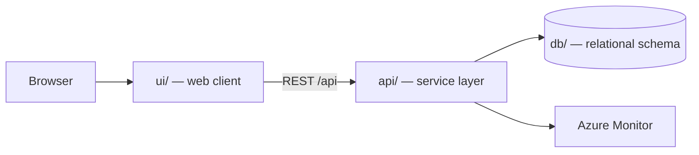

# Tutorial Engineering Knowledge Search

Engineers frequently need to find technical documents, procedures, troubleshooting guides, and best practices. Valuable information exists but is often difficult to locate quickly.

> Generated by the **Agentic SDLC / Software Factory**. Every change reaches this
> repository through an approved human gate — no agent merges its own work.

## Table of contents

1. [Overview](#overview)
2. [Architecture](#architecture)
3. [API surface](#api-surface)
4. [Screens](#screens)
5. [Folder structure](#folder-structure)
6. [Getting started](#getting-started)
7. [Build and test](#build-and-test)
8. [Deployment](#deployment)
9. [Published links](#published-links)
10. [Requirements scope](#requirements-scope)
11. [Intake documents](#intake-documents)
12. [Licence](#licence)

## Overview

| Item | Value |
| --- | --- |
| Project | Tutorial Engineering Knowledge Search |
| Business owner | myaacoub@microsoft.com |
| IT owner | myaacoub@microsoft.com |
| Target environment | Dev |
| Work items | Tutorial Engineering Knowledge Search |
| Source provider | GitHub |
| Repository | https://github.com/csdmichael/tutorial-engineering-knowledge-search |

## Architecture

Three tiers, deployed independently from this single repository:



- **ui/** renders the experience and never talks to the database directly.
- **api/** owns validation, authorization, and all data access.
- **db/** holds the schema and forward-only migrations; no ad-hoc changes.

## API surface

The service publishes an OpenAPI document, so the contract is browsable rather than
described in prose. Swagger UI is at `/docs`; the raw document is at `/openapi.json`.
The published URLs appear under [Published links](#published-links) once the pipeline runs.

| Method | Path | Purpose |
| --- | --- | --- |
| `GET` | `/health` | Liveness probe used by the deploy pipeline |
| `GET` | `/api/searches` | List searches, optionally filtered by `?status=` |
| `POST` | `/api/searches` | Create a search |
| `GET` | `/api/searches/{id}` | Fetch one search |
| `PATCH` | `/api/searches/{id}` | Update title, reference, status, priority |
| `DELETE` | `/api/searches/{id}` | Remove a search |

`db/migrations/0002_seed.sql` loads placeholder rows, and the service seeds the same rows,
so a fresh environment returns data on the first request. Replace them with real data.

## Screens

Taken from the approved UX mockups:

- **Searches**
- **Search Detail**

## Folder structure

```
.
├── ui/                  Web client
│   ├── src/             Application source
│   └── package.json     Scripts and dependencies
├── api/                 Service layer (Python (FastAPI))
│   ├── app/             Routers, models, services
│   ├── tests/           Unit and integration tests
│   └── requirements.txt Runtime dependencies
├── db/                  Database
│   ├── migrations/      Forward-only, numbered migrations
│   └── schema.sql       Current consolidated schema
├── docs/                Project documentation
│   ├── architecture.md  Tiers, data flow, decisions
│   ├── api-contracts.md Endpoint contracts
│   ├── data-model.md    Tables and relationships
│   └── delivery-plan.md Sprints and milestones
├── .github/workflows/   CI and Azure deployment pipelines
├── LICENSE              MIT
└── README.md            This file
```

## Getting started

```bash
# API
cd api && python -m venv .venv && .venv/bin/pip install -r requirements.txt
.venv/bin/uvicorn app.main:app --reload --port 8000

# UI
cd ui && npm install && npm start        # http://localhost:4200

# Database
psql "$DATABASE_URL" -f db/schema.sql
```

## Build and test

| Command | Purpose |
| --- | --- |
| `cd api && python -m pytest -q` | API unit tests |
| `cd ui && npm test` | UI unit tests |
| `.github/workflows/ci.yml and .github/workflows/deploy-azure.yml` | Runs both through GitHub Actions |

## Deployment

`.github/workflows/deploy-azure.yml` publishes the API and UI to Azure App
Service using **OIDC federated credentials** — no stored passwords. The Software
Factory configures the repository's Azure identity secrets and App Service variables
after validating the exact ID-qualified GitHub environment subject.

## Published links

<!-- agentic-sdlc:published-links:start -->
_Populated automatically once the deployment pipeline succeeds._
<!-- agentic-sdlc:published-links:end -->

## Requirements scope

- Implement a search-first experience for technical knowledge so engineers can locate documents, procedures, troubleshooting guides, and best practices rapidly, per requirements intake and derived scope.[^1]
- The requirements artifact references a “## UX Mockups (Derived)” section but the shared document had no accessible content during this review; screen flows, layout, and navigation are therefore aligned to the textual feature list and must be validated with stakeholders. **Assumption:** standard search app screens (Search, Results, Result Detail, Admin Content Catalog) match the derived description.
- No seeded content sources or authentication providers were specified; placeholders will be wired to configuration until admins supply values post-build.
- **App shell & routing:** Define high-level routes (`/search`, `/results`, `/details/:id`, `/admin/sources`) with guards prepared for future auth integration.
- **Search workspace:** Reusable components for query input, filter chips, and saved filters panel; respects tunable limits (e.g., max suggestions) sourced from `config/ui.json`.
- **Results list:** Card layout displaying title, snippet, source system, freshness indicator, confidence score; infinite scroll backed by API pagination metadata.
- **Detail view:** Read-only pane with key metadata and deep link button opening the authoritative document in a new tab; include related results sidebar.
- **Admin console:** Table to inspect indexed sources, last sync timestamps, and trigger manual rescan (calls API endpoint).
- **State management:** Use Angular signals or NGXS slice for search criteria, results cache, and user preferences (dark mode flag, default sort).
- **Error & loading UX:** Standardized loading skeletons and toast service reading message catalog in config.
- **Search endpoint (`POST /api/search`)**: Accepts query string, filters, pagination; orchestrates vector/text search providers (abstracted service).
- **Result detail endpoint (`GET /api/results/{result_id}`)**: Returns metadata and source link; caches frequently accessed content using configurable TTL.

## Intake documents

- `requirements` — [tutorial-engineering-knowledge-search-requirements.md](https://caldova37587778.sharepoint.com/sites/sdlc-tutorial-engineering-knowledge-search-e80362de/Shared%20Documents/Tutorial%20Engineering%20Knowledge%20Search/Requirements/tutorial-engineering-knowledge-search-requirements.md)

## Licence

MIT — see [LICENSE](LICENSE).
